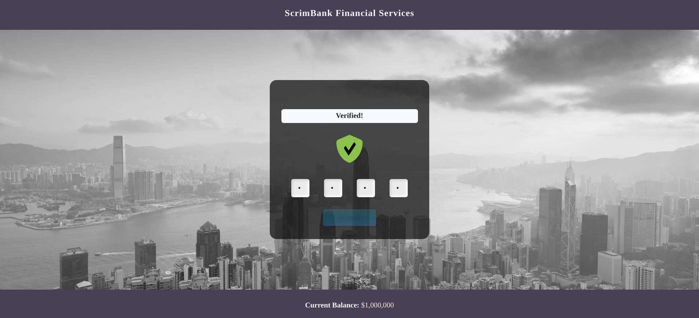

# ScrimBank Financial Services

Enter the password code and won $1,000,000.





Quick start:

````
$ npm install
$ npm run dev
$ npm start
````

````
$ pnpm install
$ pnpm run dev
$ pnpm start
````


````
$ yarn
$ yarn run dev
$ yarn start
````
Head over to https://vitejs.dev/ to learn more about using vite


-------


## Cloning the project 🪛🔨

```
# Clone this repository
$ git clone https://github.com/MastooraTurkmen/ScrimBank-Financial-Services.git

# Go inside the repository
$ cd ScrimBank-Financial-Services
```


-------

## Languages and Tools are used 🗣️🔧

1. **Languages** 🗣️

    + [HTML](https://github.com/topics/html)
    + [HTML5](https://github.com/topics/html5)
    + [CSS](https://github.com/topics/css)
    + [CSS3](https://github.com/topics/css3)
    + [React](https://github.com/topics/react)
    + [JavaScript](https://github.com/topics/javascript)

2. **Tools** 🔧

    + [Chrome](https://github.com/topics/chrome)
    + [Figma](https://github.com/topics/figma)
    + [VSCode](https://github.com/topics/vscode)
    + [Netlify](https://github.com/topics/netlify)


-------

## Deployment 📥

1. How to deploy our project to the ***Netlify*** site?
2. I use [Netlify App](https://app.netlify.com/) for deploying my projects.
4. From there select **_Deploy with Github_**.
   
5. Then write your project name and select it.
6. After selecting here you can see that the project **_Review configuration for ScrimBank-Financial-Services_** and then select the **_Deploy ScrimBank-Financial-Services_** Button.
   
   
7. Now your project is Live.


--------


## React + Vite

This template provides a minimal setup to get React working in Vite with HMR and some ESLint rules.
Currently, two official plugins are available:

- [@vitejs/plugin-react](https://github.com/vitejs/vite-plugin-react/blob/main/packages/plugin-react/README.md) uses [Babel](https://babeljs.io/) for Fast Refresh
- [@vitejs/plugin-react-swc](https://github.com/vitejs/vite-plugin-react-swc) uses [SWC](https://swc.rs/) for Fast Refresh
